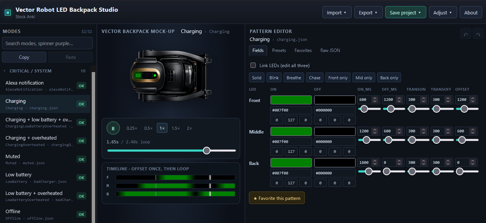

# Backpack Lights Designer

Offline web SPA for designing Vector **3-LED backpack light packs**. Preview uses the same animation math as the robot (`GetCurrentLEDcolor`). Export a robot-ready zip for `/data/data/customBackpackLights/`.



## Quick start

```bash
npm install
npm run dev      # http://localhost:5173
npm test
npm run build
npm run tauri dev    # optional desktop window
```

No server, no robot connection required for design/preview.

## Desktop builds

Native installers (Linux AppImage/deb/rpm, Windows MSI/NSIS, macOS DMG) are
produced by Tauri 2 in GitHub Actions and attached to a **draft** GitHub Release.

```bash
# local (needs Rust + platform webview deps — see https://v2.tauri.app/start/prerequisites/)
npm install
npm run tauri dev      # window + Vite on :5173
npm run tauri build    # installers under src-tauri/target/release/bundle/
```

CI: push branch `release`, tag `app-v*`, or run the `publish` workflow.
Version is `src-tauri/tauri.conf.json` → `version` (currently `0.1.0`).
The action tags `app-v__VERSION__`. Publish the draft in the GitHub Releases UI.

The web SPA is unchanged: `npm run build` still emits `/backpack/` assets
(and a PWA service worker). `tauri build` sets `TAURI_ENV_PLATFORM` so the
same Vite config emits `/` with no service worker.

## Install as an app (PWA)

`npm run build` emits an installable Progressive Web App. Upload `dist/` over
**HTTPS**; Chrome and Edge show an install icon in the address bar, Safari uses
Share → Add to Home Screen. The first visit caches the studio and bundled
packs so it works offline. Later deploys update on the next visit.

Default URLs stay under `/backpack/` (same as before):

```bash
npm run build
# copy the contents of dist/ to https://your.server/backpack/
```

To host at the site root instead:

```bash
VITE_BASE=/ npm run build
# copy the contents of dist/ to https://your.server/
```

Install requires HTTPS (localhost is allowed for testing). If the install
prompt never appears, make sure `manifest.webmanifest` is served as
`application/manifest+json` (or `application/json`). Apache picks that up
from the included `.htaccess`; nginx needs
`types { application/manifest+json webmanifest; }`.

PWA is skipped during `tauri build` — no service worker inside the desktop
webview.

## Layout

- **Modes** — all 34 CladEvents (Critical / Behavior / Utility), search, copy/paste between modes
- **Mock-up** — Front / Middle / Back LEDs driven by `samplePattern` at ~60 fps + transport + waveforms
- **Editor** — colors (hex/RGB 0–255 UI → float 0–1 model), periods, presets, raw JSON, favorites
- **Footer** — validation, sentinels, export readiness

## Robot upload

1. **Export → Robot zip** (not the `.bpld.json` project file).
2. Place pack contents at **`/data/data/customBackpackLights/`** on the robot.
3. Both sentinels required: `off.json` and `cubeSpinner/purple/spinner_purple_celebration.json`.
4. Restart robot processes so the custom path is re-read.

## Project vs robot export

| Artifact | Purpose |
|---|---|
| `*.bpld.json` | Designer project (metadata + patterns) — Save project |
| `*.zip` | Robot pack tree only — Export robot zip |

Favorites live in `localStorage` key `bpld.favorites.v1`.

## Keyboard shortcuts

| Key | Action |
|---|---|
| Space | Play / pause preview |
| ← / → | Scrub timeline (±16 ms; Shift = ±100 ms) |
| Ctrl/Cmd+Z | Undo pattern edit |
| Ctrl/Cmd+Y (or Shift+Z) | Redo |
| Ctrl/Cmd+S | Download project (`.bpld.json`) |

## Stack

Vite + React + TypeScript SPA (desktop wrap is Tauri 2; no Electron). Domain (`src/domain/`) is pure TS: schema, player, triggers, presets. Pack I/O in `src/io/packFs.ts`. Preview uses `samplePattern` / `getCurrentLedColor` (robot math). Export colors are **RGBA floats 0–1**, seven JSON keys only.
